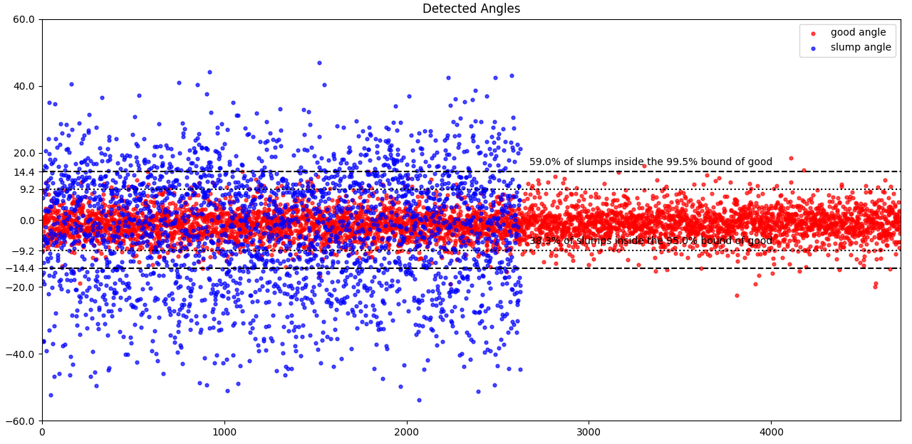

# Posture Detection

This study supports part of the [webcam-applications](https://github.com/Lai-YT/webcam-applications) project.

## Purpose

We want to detect whether the user in front of the camera has **good** or \
**slump** posture. Relies only on the body information above shoulders.

## 3-layer detection model

This implementaion of posture detection is highly related with \
face detection, as well as **face angle detection**.

### layer 1: HOG (Dlib)

After a frame is captured, it first go through the *HOG* face detection \
provided by *Dlib*. \
This detection has more restrictions on the orientation and occlusion, \
but is fast and accurate with clear faces, so is placed at the 1st layer \
to solve most of the tasks. \
If the face is detected successfully, we get the corresponding landmarks \
and utilize them to calculate the angle of face.

### layer 2: MTCNN

If the frame fails the detection of *HOG*, a second face detection layer, \
*MTCNN*, is used. \
The reason why it fails is usually because of large face rotation or severe \
occlusion, which *MTCNN* is especially good at. \
*MTCNN* also provide landmarks, so we can calculate the angle. \
It's greatest drawback is that it's about 10 times slower than *HOG*.

### layer 3: self-trained model (TensorFlow)

One of our purposes is to detect the posture when the user is writing, \
though *MTCNN* is powerful, there must be some moments that both *HOG* and \
*MTCNN* fail. So we have trained a model to cover these situations. \
Detection with model is even faster than *HOG*, but it's really hard to train \
a high accuracy model which works well regardless of background, light and \
many other interferences. So we placed the model at the last layer to avoid \
unexpected detection result.

In the first 2 layers, a threshold value of angle is set, e.g., 15 degrees. \
If the angle of face is within the threshold, we say the user has a **good** \
posture, otherwise **slump**. \
When it comes to layer 3, the *self-trained model* is already trained with \
such 2 labels, so its result of prediction directly tells the posture.

## Relation between Posture and Face Angle

The following picture illustrates the relation between posture and face angle. \
The input is 5,194 images labeled in **good** and 3,272 images labeled in \
**slump**, detected under layer 1 and 2. You can see some results are missing \
because those images fail both layers, especially in the **slump** label.

